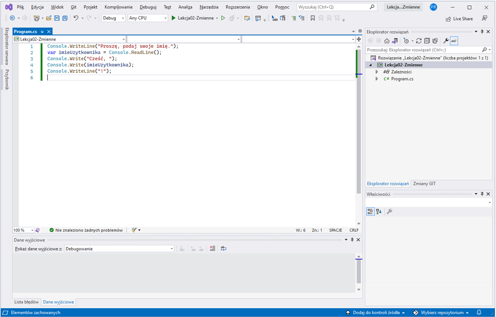

# Lekcja 2 - Zmienne, ich typy i wartości

W poprzedniej lekcji stworzyliśmy nasz pierwszy, prawdziwy program napisany w języku programowania C# na platformie .NET. Oczywiście, program ten nie robił zbyt wiele (jedynie wyświetlał napis „Hello, World!”, ale to dobry początek.

W lekcji drugiej nauczymy się czym są zmienne, do czego one służą i czym są ich typy.

Następnie – przy użyciu operatorów – wykonamy podstawowe operacje przy użyciu zmiennych.

Na koniec nauczymy się jak przy użyciu konsoli można odczytywać informacje wpisane za pomocą klawiatury.

Zaczynamy!

## Zmienne

Zmienna to bardzo ważne pojęcie w programowaniu. Za pomocą zmiennych jesteśmy w stanie zapamiętać w pamięci komputera jakąś wartość (na przykład liczbę lub napis). Następnie możemy tę wartość zmieniać według naszych potrzeb (na przykład – zwiększyć liczbę o 1 lub – dopisać do napisu kolejne słówko). W języku programowania C# zmienna posiada przypisaną do siebie nazwę (tak zwany „identyfikator”). Dzięki temu, że sami te nazwy wymyślamy, możemy w dość łatwy sposób wiedzieć do czego służy dana zmienna (o ile nadajemy naszym zmiennym nazwy które rzeczywiście coś znaczą!). Każda zmienna w języku C# posiada również swój typ, który mówi o tym, jakiego rodzaju wartości można w danej zmiennej zapisywać (np. liczby lub napisy).

### Nazwy zmiennych

Wiele początkujących programistów nie zwraca uwagi na to, jak nazywa zmienne w swoim programie. Niestety, jest to wielki błąd! Być może na samym początku wydaje się, że wymyślanie nazw zmiennych, które coś znaczą, to marnotrawstwo czasu. Niestety, szybko okazuje się, że takie myślenie jest krótkowzroczne i prowadzi do wielu błędów, kiedy tylko nasz program staje się odrobinę bardziej złożony. A więc – jak nadać zmiennej prawidłową nazwę? Jest kilka reguł, których musimy się trzymać:

1) Istnieje pewien zbiór „zastrzeżonych” słówek, które w języku C# nie mogą być użyte jako nazwy zmiennych (na przykład: if, class, var, public ... pełną listę tych słów poznamy z czasem, jednak w Visual Studio łatwo je rozpoznamy – wyświetlane są zawsze na niebiesko 😊)
2) Nazwa składa się z dowolnej liczby znaków oraz:
	1) Pierwszy znak musi być małą lub wielką literą, albo znakiem „_” lub „@”,
	2) każdy kolejny znak musi być albo literą, albo cyfrą, albo znakiem „_”,
3) Język C# rozróżnia wielkość liter w nazwach, więc „A” i „a” są traktowane jako inne litery,
4) W nazwach zmiennych nie używa się spacji (ani żadnych innych tzw. białych znaków).

Ok, czyli zgodnie z podanymi regułami poniższe nazwy są niepoprawne i kompilator zgłosi błąd, jeśli spróbujemy je użyć:

```
1abc

„Nazwa zmiennej”

class
```
Natomiast poniższe są „akceptowane” przez kompilator języka C#:

```
Aaaa

x1

_123

Łe

nazwazmiennej  
```
 
I … w zasadzie tak jest – kompilator języka pozwoli użyć nam takich nazw (nie zgłosi błędu). Są jednak pewne problemy z tymi nazwami:

1) Przede wszystkim – większość z nich nic nie znaczy. Widząc zmienną o nazwie Aaaa nie jesteśmy w stanie stwierdzić, do czego ona może służyć. Przez to nasz kod staje się ogromnie nieczytelny, i – nawet jeśli wydaje nam się, że sami go rozumiemy – to inna osoba będzie miała z tym wielkie trudności. Z resztą, my sami, po jakimś czasie, również zapomnimy w jakim celu stworzyliśmy daną zmienną i będziemy tracić cenny czas, żeby sobie przypomnieć. Pewien znany profesor z dziedziny informatyki [[1]](#_ftn1) powiedział, że „programy piszemy po to, żeby mogli je zrozumieć ludzie, a tylko przez przypadek po to, żeby komputery je uruchamiały”. Choć słowa te padły niemal 40 lat temu, to nadal są one niezwykle aktualne!
2) Użyty został typowo polski znak „Ł”. W świecie oprogramowania przyjęło się stosowanie jedynie liter występujących w j. angielskim.
3) Nie zastosowano pewnych standardów („konwencji”), które przyjęła społeczność programistów C#. Na przykład w przypadku „nazwazmiennej” nie widać wyraźnie, kiedy kończy się pierwsze a zaczyna kolejne słowo...

Jak zatem powinny wyglądać „właściwe” nazwy zmiennych?

```
licznikPunkow

kodPocztowy
```

„Dobre praktyki” jeśli chodzi o nazywanie zmiennych mówią, że:

1) Nazwy zawsze powinny coś znaczyć i muszą nam „mówić” do czego służy dana zmienna,
2) Nazwę zmiennej zawsze rozpoczynamy od małej litery,
3) Jeśli nazwa zmiennej ma więcej niż jedno słowo, to słowa te łączymy używając pewnej _konwencji_ – tak zwanego camelCase. Polega to na tym, że pierwsze słowo piszemy z małej litery, natomiast drugie i każde następne zaczynamy od Wielkiej Litery,
4) Staramy się unikać cyfr oraz znaków „_”, „@” w nazwach zmiennych.

### Typy zmiennych

Język C# wymaga od nas, aby każda zmienna miała z góry określony typ. Oznacza to, że musimy „powiedzieć” kompilatorowi jakiego rodzaju wartości będzie można zapisywać w danej zmiennej.

Istnieje wiele typów w języku C#. Do podstawowych zaliczamy tak zwane typy wbudowane (niektórzy nazywają je: „prymitywnymi”). Lista typów wbudowanych jest określona przez twórców języka i nie możemy sami dodać nowego, własnego typu wbudowanego. Nazwa każdego z tych typów jest „słówkiem zastrzeżonym” (czyli takim, którego nie możemy użyć jako nazwa zmiennej – wyświetlany w Visual Studio na niebiesko).

Poniżej lista typów wbudowanych, które warto poznać już teraz:

`int`           -  to jest liczba całkowita (bez ułamków). W C# możemy w takiej zmiennej przechować wartość z zakresu od ok. -2 000 000 000 (dwa miliardy!) do ok. +2 000 000 000.

`double`    - liczba „zmiennoprzecinkowa” czyli taka, która pozwala przechować wartości ułamkowe (rzeczywiste). Uwaga! Obliczenia przy użyciu liczb zmiennoprzecinkowych są wykonywane z pewną „dokładnością” (do ok. 16 cyfr „po przecinku”). Trzeba być więc uważnym, i nie używać tego typu, jeśli zależy nam na **bardzo** wysokiej precyzji (jednak w większości przypadków precyzja typu double jest w zupełności wystarczająca).

`bool`       – typ logiczny, który pozwala przechowywać tylko dwie wartości „true” albo „false” (czyli „prawda” albo „fałsz”). Niby niewiele, ale okazuje się, że w programowaniu typ ten jest bardzo przydatny.

`char`       – typ „Znakowy”, który pozwala przechować znak (czyli literę albo cyfrę).

`string`     – ciąg znaków, który pozwala przechowywać napisy; bardzo użyteczny i bardzo często używany.

Poza typami wbudowanymi są też bardziej złożone typy: np.: klasy, enumeratory, rekordy (nie przejmuj się jeśli nie wiesz co to jest, dowiemy się później!). Dużą różnicą w porównaniu do typów wbudowanych jest to, że sami możemy tworzyć nowe typy złożone 😊. Nauczymy się tego później, lecz na razie skupmy się na typach wbudowanych.

## Zapisywanie wartości przy pomocy „literałów”.

Kiedy utworzymy zmienną, najprawdopodobniej będziemy chcieli przypisać do niej jakąś wartość. Wartość tę możemy np. skopiować z innej zmiennej, lub obliczyć przy użyciu różnych funkcji dostępnych w języku C#.  Jednak zwykle musimy od czegoś zacząć – na przykład nadać zmiennej jakąś wartość początkową. Na przykład zero dla liczby. Lub literkę „a” dla znaku. Jak to zrobić? Przy użyciu tak zwanych „literałów”. Każdy typ wbudowany posiada swój własny sposób na zapisanie wartości przez „literał”:

**Dla liczb całkowitych**, po prostu zapisujemy wartość dziesiętnie, bez żadnych dodatkowych znaków (takich jak cudzysłowie, spacje rozdzielające cyfry itp.). Możemy użyć znaku „-” (minus) z przodu liczby, jeśli chcemy zapisać liczbę ujemną. Przykłady poniżej:

```
0

-123

384403
```

_Uwaga: wartości liczb całkowitych możemy też zapisywać w postaci literałów przy użyciu innych systemów liczbowych: szesnastkowo lub binarnie. Jednak nie jest to nam teraz potrzebne i nie będziemy się tym zajmować._

**Dla liczb rzeczywistych** (zmiennoprzecinkowych) – również zapisujemy wartość, ale zawsze podajemy są z „przecinkiem” czyli ułamkiem dziesiętnym


```
0.0

123.5

-23.0
```

**Dla wartości logicznych** mamy tylko 2 wartości i obie są uwzględnione przez twórców języka jako „słowa zastrzeżone”:

```
true

false
```

**Dla wartości znakowych**, wpisujemy znak wewnątrz pojedynczych cudzysłowów, na przykład:

```
'a'

'1' <- uwaga! To jest cyfra 1, nie wartość liczbowa!

**Ciągi znaków** zapisujemy wewnątrz podwójnych cudzysłowów, na przykład:

"Hello, World!"

"Witaj, Świecie!"
```

Specjalnym przypadkiem ciągu znaków jest tak zwany „pusty ciąg”, czyli inaczej pusty napis (nie posiadający ani jednego znaku). Zapisujemy go w taki sposób:

`""`

## Tworzenie zmiennych (czyli inaczej „deklaracja ziennych”)

Ok, teraz już wiemy jakich zasad należy przestrzegać podczas nadawania nazwy zmiennej, wiemy co to są typy i jak zapisywać wartości przy użyciu literałów. Dowiedzmy się więc jak tworzymy zmienne.

**Pierwszy sposób: podanie typu w sposób jawny:**

- najpierw piszemy nazwę typu,
- następnie, po spacji, piszemy wymyśloną przez nas nazwę zmiennej,
- następnie (o ile chcemy – nie jest to konieczne) – nadajemy zmiennej wartość początkową za pomocą „=” (znak „równa się”) oraz wartości po drugiej stronie tego znaku (wartość może być np. literałem),
- na koniec stawiamy średnik.

Przykłady:

```csharp
int licznikPunktow = 0;

string nazwisko = "Kowalski";

double odleglosc = 10.15;

// nie musimy od razu przypisywać wartości zmiennej, możemy to zrobić później

char inicjalDrugiegoImienia;

// ...  
inicjalDrugiegoImienia = 'S';

// Wartość nie musi być określona przez literał. Możemy, np. skopiować  
// wartość innej zmiennej:

int licznikPunktowPoziomuDrugiego = licznikPunktow;
```

W jednej linijce możemy stworzyć kilka zmiennych, oddzielając je przecinkiem (jednak rzadko się to robi w przypadku zmiennych). Wtedy wszystkie te zmienne będą miały ten sam typ, np.:

`int licznikPunktow = 0, liczbaZyc=3;`

**Drugi sposób: użycie słówka** **var** **:**

- najpierw używamy słówko var (od ang. variable, czyli zmienna),
- po spacji wpisujemy nazwę zmiennej,
- następnie musimy nadać wartość początkową (za pomocą „=”) – jest to potrzebne, żeby kompilator „domyślił się” jaki zmienna ma mieć typ,
- na koniec stawiamy średnik.

Przykłady:

```csharp
var licznikPunktow = 0;

var nazwisko = "Kowalski";

var odleglosc = 10.15;

var licznikPunktowPoziomuDrugiego = licznikPunktow;
```

Jeśli używamy słówka **var**, możemy stworzyć tylko jedną zmienną w jednej linijce;

## Odczytywanie polecenia z klawiatury i zapisanie go do zmiennej

Wiemy już jak tworzyć zmienne, potrafimy też przypisywać do nich wartości przy użyciu

 - „literałów”, czyli stałych wartości napisanych w kodzie programu,
 - wartości „skopiowanych” (pobranych) z innych zmiennych.

Jednak do napisania ciekawego programu przydatna byłaby funkcja pozwalająca wpisać wartość przez użytkownika naszego programu i zapisać ją do zmiennej.

W poprzednim rozdziale mówiliśmy o konsoli – o tym, że za jej pomocą można:

 a) pisać tekst na ekranie,
 b) odczytywać wpisane przy użyciu klawiatury polecenia.

No właśnie, jeśli chodzi o pisanie to już wiemy, że możemy wykorzystać _metodę_ WriteLine(). Jak jest z czytaniem?

`var polecenie = Console.ReadLine();`

Przykład powyżej przedstawia typowe użycie klasy Console do odczytania wartości. Jak to działa?

 - po lewej stronie znaku „=”  tworzymy zmienną o nazwie „polecenie
 - po prawej stronie, wywołujemy metodę „ReadLine()” z klasy Console. Metoda ta, podczas wykonania naszego programu, poczeka aż użytkownik wpisze coś przy pomocy klawiatury i naciśnie przycisk „Enter”. Wpisany przez użytkownika tekst zostanie _zwrócowny_ jako wartość (typu string) i zapisana do zmiennej „polecenie”.
 - na końcu, oczywiście, używamy średnika, żeby „powiedzieć kompilatorowi, że kończymy naszą instrukcję.

Ok, w takim razie spróbujmy wykorzystać tę wiedzę do napisania takiego oto programu:

1) Na początek program zachęci użytkownika poprzez napisanie tekstu „Proszę podaj swoje imię.”,
2) Następnie program poczeka, aż użytkownik wpisze swoje imię (np. „Michał”),
3) Kiedy użytkownik zatwierdzi wpisanie swojego imienia poprzez wciśnięcie klawisza „Enter”, nasz program wyświetli komunikat „Cześć, Michał!” i zakończy swoje działanie.

Spróbujmy rozwiązać tę zagadkę wspólnie.

Punkt 1. Chyba już wiemy: wykorzystamy po prostu tę samą metodę co w rozdziale 1 – WriteLine():

`Console.WriteLine("Proszę, podaj swoje imię.");`

Punkt 2. Wykorzystajmy nowopoznaną metodę ReadLine():

`var imieUzytkownika = Console.ReadLine();`

Punkt 3. Tutaj sytuacja się troszkę komplikuje. Domyślamy się, że będziemy musieli użyć ponownie metody `WriteLine()`, jednak jak zrobić, żeby wpisane imię połączyć z tekstem „Cześć,”  i z wykrzyknikiem w jednej linijce? Jest wiele sposobów, żeby to zrobić, ale na początek podam sposób chyba najprostszy. Mianowicie, poza metodą `WriteLine()`, która po wydrukowaniu tekstu na ekranie przenosi kursor do następnej linijki, jest też inna metoda – `Wite()`, która różni się tym, że po wydrukowaniu tekstu nie przenosi kursora do następnej linijki. Zatem jeśli wywołamy `Write()` kilkakrotnie – to wszystkie napisy pojawią się w tej samej linijce 😊:

```csharp
Console.Write("Cześć, ");

Console.Write(imieUzytkownika);

Console.WriteLine("!");
```

Teraz spróbuj stworzyć nowy program (projekt) przy użyciu szablonu „Aplikacja konsoli” – nazwijmy go „Lekcja02-Zmienne”:


Skasujmy wygenerowane przez Visual Studio 2 linijki kodu i zastąpmy je naszym programem:




Uruchamiany nasz program i sprawdzamy, czy działa rzeczywiście tak, jak tego oczekiwaliśmy 😊

Wspaniale, właśnie udało Ci się stworzyć pierwszy „interaktywny” program komputerowy. Doskonale!

Teraz dla wprawy rozszerzysz swój program o dodatkową funkcję. Jednak zanim to zrobisz, nauczymy się dwóch dodatkowych rzeczy.

Pierwszą rzeczą jest odczytywanie z klawiatury wartości liczbowych. Jak wiemy, w języku C# każda zmienna ma swój typ. Kompilator sprawdza, czy czasami nie próbujemy wpisać do zmiennej wartości, której typ nie jest zgodny. Poznana przez nas metoda Console.ReadLine() zwraca zawsze wartość typu string (czyli napis) i nie jest możliwe zapisanie takiej wartości do zmiennej liczbowej (całkowitej lub rzeczywistej):

```csharp
// to niestety nie zadziała! Nie możemy zapisać wartości "string"  
// do zmiennej typu "int"

int wartoscCalkowita = Console.ReadLine();
```

Na szczęście jest pewna pomocna klasa, która pozwoli nam w łatwy sposób zamienić wartość „string” na liczbę: jest to klasa Convert która posiada m.in. metody „ToInt32()” (która zamienia – czyli _konwertuje_ – napis na wartość będącą liczbą całkowitą) i „ToDouble()” (która zamienia napis na liczbę rzeczywistą).

```csharp
// ale to zadziała! (oczywiście pod warunkiem, że wartość którą wpisał  
// użytkownik rzeczywiście będzie liczbą..)

var wartoscJakoNapis = Console.ReadLine();

var wartoscCalkowita = Convert.ToInt32(wartoscJakoNapis);

var wartoscRzeczywista = Convert.ToDouble(wartoscJakoNapis);
```

Kolejną rzeczą, którą musimy wiedzieć przed przystąpieniem do zadania, jest to, że przy użyciu zmiennych możemy wykonywać obliczenia. Służą do tego tzw. operatory, które dokładniej poznamy w kolejnej lekcji. Na razie wystarczy, że poznamy dwa podstawowe operatory, które możemy stosować pomiędzy zmiennymi (lub literałami) tego samego typu liczbowego. Operatory te to: dodawanie, czyli „+” i mnożenie, czyli „*”

```csharp
var liczbaA = 2.5;

var liczbaB = 2.0;

var sumaLiczb = liczbaA + liczbaB; // sumaLiczb zostanie ustawiona na 4.5

var ilorazLiczb = liczbaA * liczbaB; // ilorazLiczb zostanie ustawiony na 5.0

var sumaLiczbPomnozonaPrzezDwa = sumaLiczb * 2.0; // = 9.0

var ilorazLiczbPowiekszonyoTrzy = ilorazLiczb + 3.0; // = 8.0
```

Podobnie to działa dla liczb całkowitych:

```csharp
var liczbaA = 3;

var liczbaB = 2;

var sumaLiczb = liczbaA + liczbaB; // sumaLiczb zostanie ustawiona na 5

var ilorazLiczb = liczbaA * liczbaB; // ilorazLiczb zostanie ustawiony na 6

var sumaLiczbPomnozonaPrzezDwa = sumaLiczb * 2; // = 10

var ilorazLiczbPowiekszonyoTrzy = ilorazLiczb + 3; // = 9
```

Ok – to teraz zadanie. Rozszerz swój program o następującą funkcję: po przywitaniu się z użytkownikiem (co już mamy zrobione) program:

1) Poprosi użytkownika o podanie długości boku prostokąta w cm (wartość rzeczywistą)
2) Następnie poczeka aż użytkownik wpisze wartość,
3) Po zatwierdzeniu poprosi o podanie długości drugiego boku prostokąta w cm (wartość rzeczywistą)
4) Następnie poczeka aż użytkownik wpisze wartość,
5)  Po zatwierdzeniu, program obliczy pole prostokąta (mnożąc dwie podane liczby) i wydrukuje na ekranie informację według schematu „Pole prostokąta wynosi: … centymetrów kwadratowych”.

# Podsumowanie

Poniżej przedstawiam listę najważniejszych rzeczy, których nauczyliśmy się w drugiej części naszej przygody z programowaniem:

- wiemy czym są zmienne w języku programowania,
- znamy reguły, jakie należy stosować podczas nadawania nazw zmiennym,
- wiemy czym są typy wbudowane i znamy kilka z nich,
- wiemy jak „zadeklarować” czyli utworzyć zmienną,
- potrafimy w aplikacji konsoli odczytać wpisaną przez użytkownika wartość do zmiennej (zarówno do zmiennej przechowującej napis jak i do zmiennej typu liczbowego),
- znamy podstawowe operatory, za pomocą których możemy wykonywać obliczenia.

Teraz spędź trochę czasu i przerób napisany przez nas program według własnego pomysłu. Może napiszesz aplikację, która doda podaną przez użytkownika liczbę dzieci w klasie IV „a”, IV „b” oraz IV „c”, żeby obliczyć ile jest wszystkich uczniów klas IV? A może wymyślisz coś całkowicie innego? Spróbuj!

---

[[1]](#_ftnref1) Harold Abelson, m.in. twórca języka Logo dla komputera Apple II

[[2]](#_ftnref2) Jedną z dodatkowych reguł jest również to, że nazwy wszelkich identyfikatorów piszemy w języku angielskim, jednak podczas naszej Pierwszej przygody z programowaniem będziemy używać polskich słów (lecz bez polskich znaków)